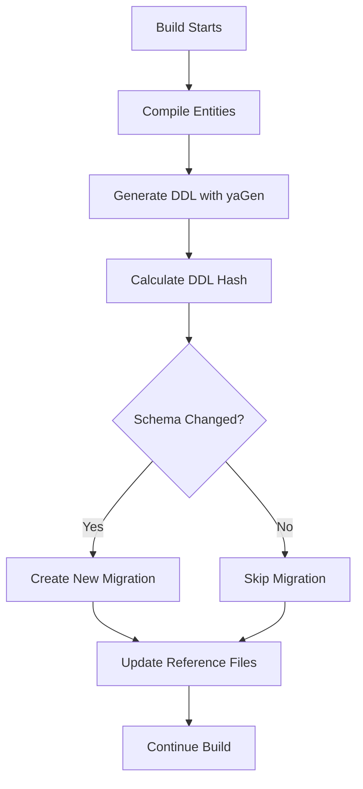

# Automated DDL Generation and Migration System

## Overview

This system automatically generates DDL from yaGen-annotated entities and creates Flyway migrations when schema changes are detected. This ensures your database schema stays in sync with your entity definitions without manual intervention.

## How It Works

### 1. **Automatic Execution**
- **During Build**: The system runs automatically as part of `./gradlew build`
- **Before Packaging**: DDL generation happens before creating the JAR file
- **Change Detection**: Only creates migrations when actual schema changes are detected

### 2. **Process Flow**


### 3. **Components**

#### **AutoDDLGenerationTest**
- Main test class that orchestrates the process
- Generates DDL using Spring Boot's schema generation
- Compares with previous DDL using SHA-256 hashes
- Creates Flyway migrations when changes detected

#### **DDL Generation Config**
- Spring configuration that prepares directories
- Activated with `ddl-generation` profile
- Ensures proper yaGen setup

#### **Build Integration**
- Gradle tasks integrated into build lifecycle
- Automatic execution before packaging
- Manual execution available for development

## Files and Directories

### **Generated Files**
```
target/generated-ddl/
├── create-auto.sql      # Current DDL schema
├── create-reference.sql # Previous DDL for comparison
├── drop-auto.sql        # Drop statements (not used in migrations)
└── ddl-hash.txt         # SHA-256 hash of current DDL
```

### **Migration Files**
```
src/main/resources/db/migration/
└── V{n}__auto_generated_schema_update_{timestamp}.sql
```

### **Scripts**
```
scripts/
├── generate-migrations.sh  # Manual generation (Linux/Mac)
└── generate-migrations.bat # Manual generation (Windows)
```

## Usage

### **Automatic (Recommended)**
```bash
# DDL generation and migration creation happens automatically
./gradlew build

# Or when building Docker images
docker-compose up --build
```

### **Manual Generation**
```bash
# Using Gradle task
./gradlew generateDDLAndMigrations

# Using convenience scripts
./scripts/generate-migrations.sh      # Linux/Mac
scripts\generate-migrations.bat       # Windows
```

### **Development Workflow**

1. **Modify Entities**: Add/modify yaGen annotations on entities
   ```java
   @Entity
   @Auditable
   @TemporalEntity
   public class MyEntity {
       // entity changes
   }
   ```

2. **Build Project**: Run build to trigger migration generation
   ```bash
   ./gradlew build
   ```

3. **Review Migration**: Check generated migration file
   ```bash
   ls src/main/resources/db/migration/V*__auto_generated_*.sql
   ```

4. **Test Migration**: Start application to apply migration
   ```bash
   docker-compose up
   ```

## Configuration

### **Application Properties**
```properties
# Enable/disable automatic migration generation
yagen.auto-migration.enabled=true

# yaGen DDL generation settings
spring.jpa.properties.yagen.generator.history.enabled=true
spring.jpa.properties.yagen.generator.history.suffix=_HST
```

### **Profile Configuration**
The system uses `ddl-generation` profile with specific settings:
- In-memory H2 database for DDL generation
- Disabled web application startup
- Enhanced logging for debugging

## Generated Migration Format

### **Migration Header**
```sql
-- Auto-generated migration from yaGen DDL
-- Generated at: 2025-09-03T01:30:00
-- DDL Hash: a1b2c3d4e5f6...
-- DO NOT EDIT THIS FILE MANUALLY
```

### **Migration Content**
- Only CREATE and ALTER statements (no DROP statements)
- `IF NOT EXISTS` clauses for safety
- Processed for PostgreSQL compatibility
- History tables automatically included

### **Example Migration**
```sql
-- Auto-generated migration from yaGen DDL
-- Generated at: 2025-09-03T01:30:00
-- DDL Hash: a1b2c3d4e5f6789...
-- DO NOT EDIT THIS FILE MANUALLY

CREATE TABLE IF NOT EXISTS identifier_types_hst (
    hst_uuid uuid NOT NULL,
    hst_operation VARCHAR(10) NOT NULL,
    hst_timestamp TIMESTAMP WITH TIME ZONE NOT NULL,
    -- ... other columns
);

CREATE INDEX IF NOT EXISTS idx_identifier_types_hst_uuid 
ON identifier_types_hst(uuid);
```

## Benefits

### **1. Automated Schema Management**
- No manual migration creation needed
- Schema always in sync with entity definitions
- Reduces human error in migration creation

### **2. Change Detection**
- Only generates migrations when actual changes occur
- SHA-256 hash comparison ensures accuracy
- Avoids unnecessary migration files

### **3. yaGen Integration**
- Leverages yaGen's enhanced DDL generation
- Automatic history table creation
- Advanced constraint and index support

### **4. CI/CD Friendly**
- Integrates seamlessly into build pipelines
- Deterministic migration generation
- Version-controlled schema evolution

## Troubleshooting

### **No Migration Generated**
If no migration is created when you expect one:
1. Check that entity changes include yaGen annotations
2. Verify the build completed successfully
3. Look for DDL generation logs in build output
4. Check if `ddl-hash.txt` was updated

### **Build Failures**
If DDL generation fails during build:
1. Check entity annotations are correct
2. Verify yaGen dependencies are present
3. Review DDL generation logs for errors
4. Ensure H2 database is available for testing

### **Manual Override**
If you need to force migration generation:
1. Delete `target/generated-ddl/ddl-hash.txt`
2. Run `./gradlew generateDDLAndMigrations`
3. This will treat the next DDL as "changed"

### **Debugging**
Enable detailed logging:
```properties
logging.level.org.identityshelf.ddl=DEBUG
logging.level.com.github.gekoh.yagen=DEBUG
logging.level.org.hibernate.tool.schema=DEBUG
```

## Best Practices

### **1. Entity Design**
- Always use yaGen annotations for new entities requiring audit trails
- Keep entity changes focused and atomic
- Test entity changes locally before committing

### **2. Migration Review**
- Always review generated migrations before deployment
- Verify migration content matches intended changes
- Test migrations on development database first

### **3. Version Control**
- Commit generated migrations with entity changes
- Include migration files in pull requests
- Document significant schema changes in commit messages

### **4. Deployment**
- Migrations are applied automatically on application startup
- Monitor application logs during deployment
- Have rollback plan for problematic migrations

## Integration with Existing System

### **Coexistence with Manual Migrations**
- Auto-generated migrations use specific naming pattern
- Manual migrations can still be created normally
- Flyway processes all migrations in version order

### **History Table Strategy**
- yaGen creates history tables automatically
- Manual history tables (like V16 migration) can coexist
- Consider migrating to pure yaGen approach over time

### **Migration Versioning**
- Auto-generated migrations use next available version number
- System respects existing manual migration versions
- No conflicts with existing migration sequences

