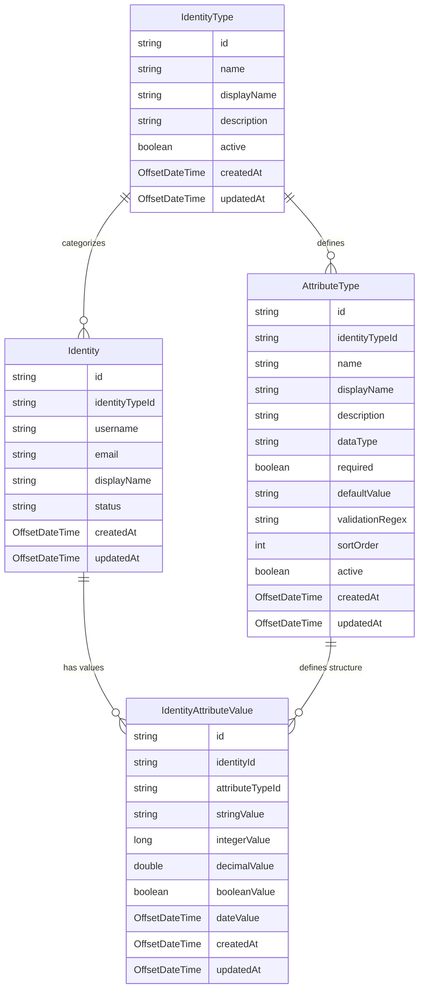

# IdentityShelf Object Diagram

This diagram shows the domain model and relationships in the IdentityShelf system.



## Alternative Class Diagram Version

If the ER diagram still has issues, here's a class diagram version:

```mermaid
classDiagram
    class IdentityType {
        +String id
        +String name
        +String displayName
        +String description
        +boolean active
        +OffsetDateTime createdAt
        +OffsetDateTime updatedAt
        +addAttribute(AttributeType)
        +removeAttribute(AttributeType)
    }
    
    class AttributeType {
        +String id
        +String name
        +String displayName
        +String description
        +AttributeDataType dataType
        +boolean required
        +String defaultValue
        +String validationRegex
        +int sortOrder
        +boolean active
        +OffsetDateTime createdAt
        +OffsetDateTime updatedAt
    }
    
    class Identity {
        +UUID id
        +String username
        +String email
        +String displayName
        +IdentityStatus status
        +OffsetDateTime createdAt
        +OffsetDateTime updatedAt
        +addValue(IdentityAttributeValue)
        +removeValue(IdentityAttributeValue)
        +getValueForAttribute(String)
    }
    
    class IdentityAttributeValue {
        +String id
        +String stringValue
        +Long integerValue
        +Double decimalValue
        +Boolean booleanValue
        +OffsetDateTime dateValue
        +OffsetDateTime createdAt
        +OffsetDateTime updatedAt
        +getValue()
        +setValue(Object)
    }
    
    class IdentityStatus {
        <<enumeration>>
        ACTIVE
        SUSPENDED
        ARCHIVED
        ESTABLISHED
    }
    
    class AttributeDataType {
        <<enumeration>>
        STRING
        INTEGER
        DECIMAL
        BOOLEAN
        DATE
        DATETIME
        EMAIL
        PHONE
        URL
        SELECT
        MULTI_SELECT
    }

    IdentityType ||--o{ AttributeType
    IdentityType ||--o{ Identity
    Identity ||--o{ IdentityAttributeValue
    AttributeType ||--o{ IdentityAttributeValue
    Identity }o--|| IdentityStatus
    AttributeType }o--|| AttributeDataType
```

## Troubleshooting Tips:

1. **Check Mermaid extension version** - Some older versions have syntax limitations
2. **Try the class diagram** if ER diagram fails
3. **Remove special characters** - Some Mermaid parsers are sensitive to quotes and special symbols
4. **Use simple relationship labels** without quotes if needed

The simplified version should render correctly in VS Code with the Mermaid extension!
